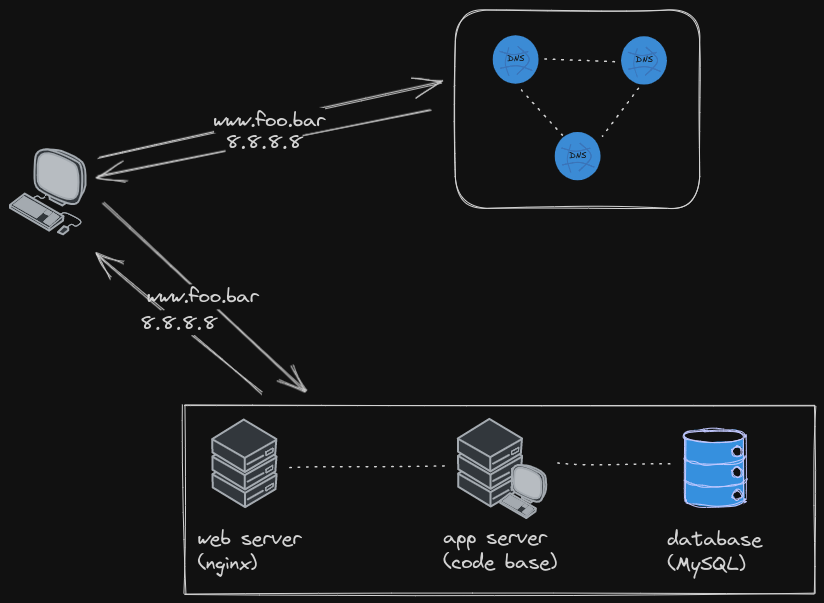

## Simple web stack

### Server

A server is a [virtual] device or a computer program which manages access to a centralised resource and distribute them to other computers, called "clients", upon request.

### Domain name

Every computer on the internet is represented by an IP address. A domain name is a convenient word that maps to a specific IP address.

### DNS record `www`

The DNS record `www` represents a CNAME, which is a type of DNS record that maps an alias to a canonical name.

### Web server

A web server is a server which serves web content such as HTML files.

### Application server

An application server is a program which acts as an intermediary between a web server and a source of data such as databases and business logic.

### Database

A database simply exists to store serialized data persistently

### SPOF (single point of failure)

A single point of failure is a part of a network system which failure will consequently cause the failure of the entire system

Downtime maintenance is needed in production softwares in order to synchronize the server with new data or changes.

Also, a simple web infrastructure as demonstrated in the accomapbying image, will not scale because there is no load balancing or redundancy of servers.
