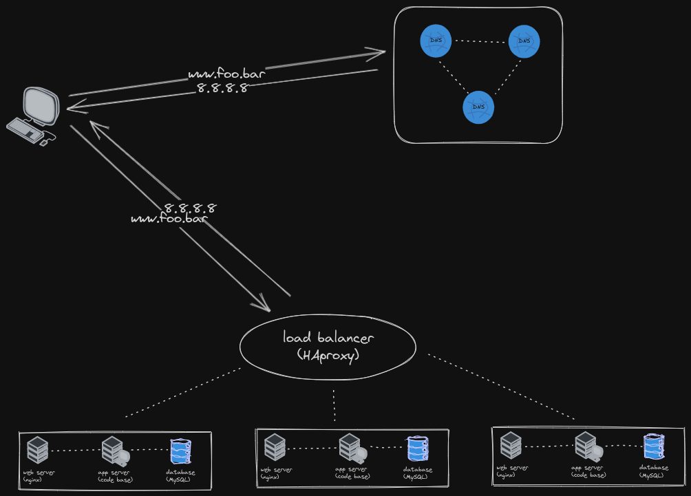

## Distributed web infrastructure

The distributed web infrastructure features redundancy of servers so as to accommodate many requests. However, for this to work, a load balancer which algorithmically distributes requests to the servers is needed.

The load balancer uses the Round Robin algorithm which distributes incoming requests sequentially and cyclically to servers.

The load balancer uses Active-Active setup which implies that servers are running uniformly and simultanously, contrary to an Active-Passive setup in which some nodes are on standby while others run.
