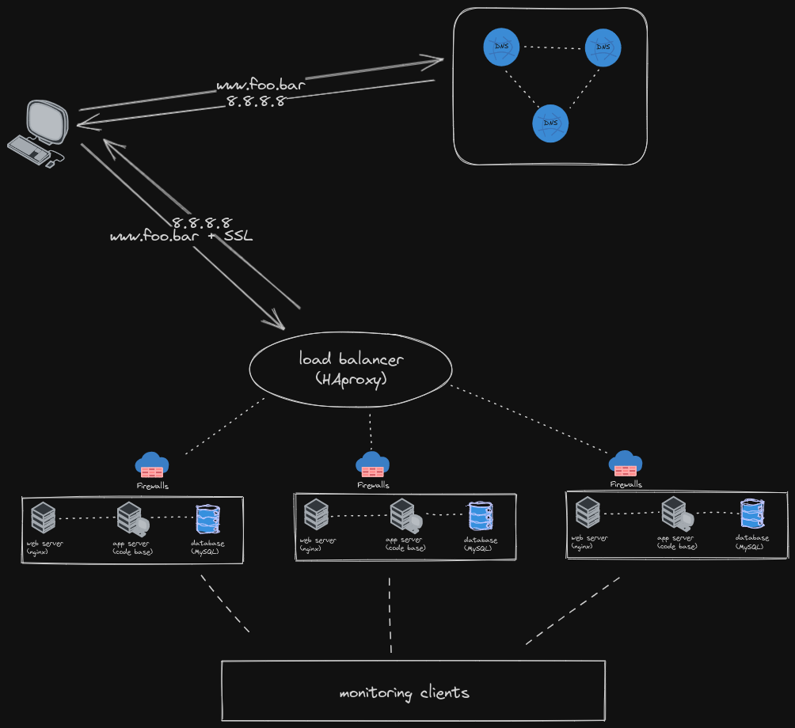

## Secured and monitored web infrastructure

Firewalls protect a network from known IP addresses considered to be of a malicious client. They prevent traffic from these addresses from getting to the host computer (server).

HTTPS encrypts request/response payload, thereby improving security in data exchange between clients and servers
